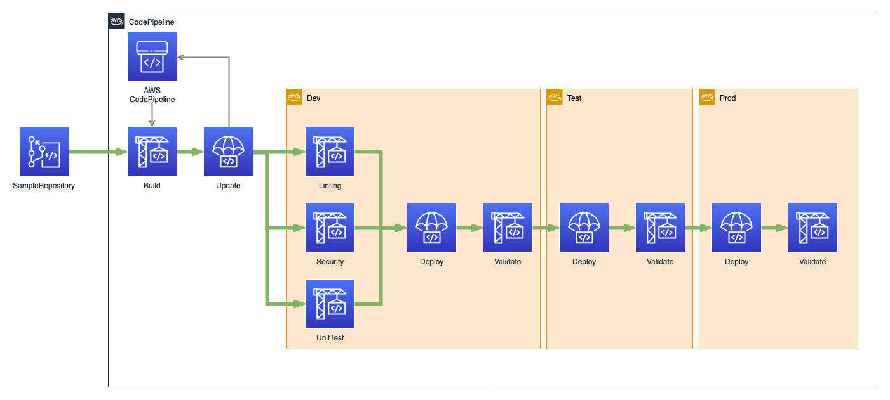

[](https://github.com/aws-samples/aws-codepipeline-cicd/actions/workflows/pipeline.yaml)

# AWS CodePipeline with CI/CD practices
## Introduction
This pattern defines a re-usable CI/CD pipeline written using [AWS CDK v2 (CDK)](https://aws.amazon.com/cdk/). The pipeline includes tests to validate the security of your 3rd party libraries and ensures expedited as well as automated release in desired environments. You can increase the overall security of your applications by putting them through a validation process.

* CodePipeline

AWS CodePipeline is a continuous integration and continuous delivery (CI/CD) service. The service itself is made of different stages, that can be made of different AWS services like [AWS CodeBuild](https://aws.amazon.com/codebuild/) or [AWS CodeDeploy](https://aws.amazon.com/codedeploy/). This extensibility allows AWS CodePipeline to run tasks like compiling or packaging your application code and deploying the generated artifact to a fleet of EC2 instances. To trigger a pipeline you can choose from different options like reacting to code changes made to a AWS CodeCommit repository. AWS CodePipeline deploys the code to various environments such as development, quality assurance and production. To promote the code from one environment to another, e.g. QA/Test to Prod, we recommend you define an approval pattern, either manual or automated, that fits your organization's controls. You can find more information in this [AWS user guide documentation](https://docs.aws.amazon.com/codepipeline/latest/userguide/welcome.html) on AWS CodePipeline.

* CloudFormation stacks

CloudFormation is an AWS service for provisioning infrastructure as code (IaC) through the use of YAML or JSON templates. It uses stacks to logically group various AWS services into a collection, which can be managed as a single unit. These stacks can create things like a AWS CodeCommit repository and a AWS CodePipeline CI/CD pipeline.

## Architecture


The pipeline is triggered by a change in the AWS CodeCommit repository (SampleRepository). In the beginning it builds artifacts, updates itself and starts the deployment process. The resulting pipeline deploy solution to three independent environments:
* Dev - code check, active development environment
* Test - integration and regression test environment
* Prod - production environment

In the Dev stage there are 3 steps `Linting`, `Security` and `Unit Tests`. These run in parallel to speed up the process. To ensure the pipeline only provides working artifacts, it will be stop executing whenever a step in the process fails. After a Dev stage deployment, the pipeline runs validation tests verifying the results. In case of success, the pipeline will then deploy to the Test environment containing post-deployment validation. The final step is to deploy the artifacts to the Prod environment.

## Prerequsites & Limitations

This project use AWS CDK v2 based on typescript. The developer laptop/computer should have following software.
* [AWS CDK v2](https://docs.aws.amazon.com/cli/latest/userguide/getting-started-install.html) v2.118.0
* [cfn_nag](https://github.com/stelligent/cfn_nag) v0.8.10
* [git-remote-codecommit](https://docs.aws.amazon.com/codecommit/latest/userguide/setting-up-git-remote-codecommit.html) v1.16
* [node](https://nodejs.org/en/download/) v20

#### AWS Cloud9

If you are using AWS [Cloud9](https://aws.amazon.com/cloud9/), you can use following command to install the prerequisites:

```bash
gem install cfn-nag
```
Note: Cloud9 should have node and npm installed. You can check the installation or version by running the following command:

```bash
node -v
npm -v
```
### AWS CLI SetUp

- Windows: [Configure for HTTPS connections to your CodeCommit repositories](https://docs.aws.amazon.com/codecommit/latest/userguide/setting-up-https-windows.html)
- Linux, macOS, Unix: [Configure for HTTPS connections to your CodeCommit repositories](https://docs.aws.amazon.com/codecommit/latest/userguide/setting-up-https-unixes.html)

## Initial Deployment

For the initial deployment in your AWS account, you can run the following command:

### Getting the code

Dowload the latest __Source code__ from [release](https://github.com/aws-samples/aws-codepipeline-cicd/releases) and unzip the downloaded file into a folder.

As an alternative option you may clone the project and delete the .git folder from it. Below you can see an example.

```bash
git clone --depth 1 https://github.com/aws-samples/aws-codepipeline-cicd.git
```
You should remove `.git` dir from the cloned repository as [later](#set-up-remote-codecommit-repository-and-branch) we will use newly created codecommit repository as a remote origin.

```bash
cd ./aws-codepipeline-cicd
rm -rf ./.git
```

### Connect to AWS Account

You can connect by using a temporary security token or landing zone authentication. To confirm that you are using the correct account and AWS Region, run the following commands:

```bash
AWS_REGION="eu-west-1"
ACCOUNT_NUMBER=$(aws sts get-caller-identity --query Account --output text)
echo "${ACCOUNT_NUMBER}"
```

### Bootstrapping an environment

```bash
npm install
npm run build
npm run cdk bootstrap "aws://${ACCOUNT_NUMBER}/${AWS_REGION}"
```

After successful bootstrap, you should see the following output:
```bash
 ⏳  Bootstrapping environment aws://{account#}/eu-west-1...
 ✅  Environment aws://{account#}/eu-west-1 bootstrapped.
```

For more details refer CDK Bootstraping section in [AWS CDK v2](https://docs.aws.amazon.com/cdk/v2/guide/bootstrapping.html).

### Synthesize a template

To synthesize a CDK app, use the `cdk synth` command:

```bash
npm run cdk synth
```
You should see following output:

```bash
Successfully synthesized to <path-to-directory>/aws-codepipeline-cicd/cdk.out
Supply a stack id (CodePipeline, Dev-MainStack) to display its template.
```

### Deploy CodePipeline stack

Now, you can deploy the CodePipeline stack by running following command. This is required as it will create the necessary prerequisites(CodeCommit Repository) for the CodePipeline.

```bash
npm run cdk -- deploy CodePipeline --require-approval never
```

You should see output like following:
```bash
CodePipeline: deploying...
CodePipeline: creating CloudFormation changeset...


 ✅  CodePipeline

Outputs:
CodePipeline.RepositoryName = SampleRepository
Stack ARN:
arn:aws:cloudformation:REGION:ACCOUNT-ID:stack/CodePipeline/STACK-ID
```

### Set up remote CodeCommit Repository and branch

After successful deployment of CodePipeline stack, you should see the newly created CodeCommit repository and CodePipeline.

You can see the CodePipeline initial execution in [AWS CodePipeline console](https://eu-west-1.console.aws.amazon.com/codesuite/codepipeline/pipelines). By default when you create a repository in CodeCommit via CDK, no branch is created and thats why CodePipeline is failing to execute with below error:

`The action failed because no branch named main was found in the selected AWS CodeCommit repository SampleRepository. Make sure you are using the correct branch name, and then try again. Error: null`

## Development process via Makefile

To simplify development process and provide an ability to run tests locally we use a Makefile. The Makefile has same steps as AWS Codepipeline. A developer can execute the whole pipeline locally by command make, or execute individual step.

* Execute local pipeline: `make`
* Execute only unit testing: `make unittest`
* Deploy to the current account: `make deploy`
* Cleanup the environment: `make clean`

## Destroy CDK app resources

To clean up your CDK app run the below command:
```bash
cdk destroy --all
```

